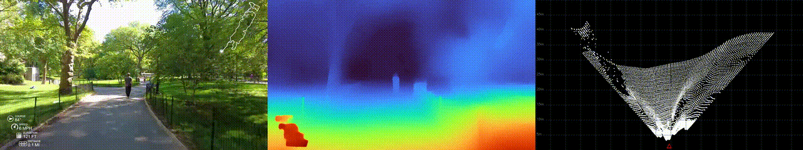

# RGB-D and LiDAR Simulation from Video

This repository generates RGB-D frames and simulates LiDAR scan data from video sequences using MiDaS depth estimation. The system creates realistic sensor data for robotics applications, particularly useful for autonomous navigation and perception system development.

## Features

- **RGB-D Generation**: Extract RGB frames and generate corresponding depth maps using MiDaS DPT_Large model
- **LiDAR Simulation**: Simulate realistic LiDAR point clouds with configurable beam patterns and resolution
- **Multi-Modal Visualization**: Create side-by-side preview videos showing RGB, depth, and LiDAR bird's eye view
- **Configurable Parameters**: Adjust FPS, LiDAR beam count, resolution, and depth range
- **Batch Processing**: Process video segments efficiently with progress tracking

## Preview



*Side-by-side visualization showing: RGB frame (left), depth map with Turbo colormap (middle), and LiDAR points in bird's eye view (right)*

*I extracted the preview video from this YouTube video - https://www.youtube.com/watch?v=onxQ1Gj3C6U - a man walking through Central Park in NYC*

## Installation

1. Clone this repository:
```bash
git clone <repository-url>
cd robotics_python
```

2. Install dependencies:
```bash
pip install -r requirements.txt
```

3. The MiDaS model will be automatically downloaded on first run via PyTorch Hub.

## Usage

### Basic Usage
```bash
python generate_data.py --video /path/to/input.mp4
```

### Advanced Usage with Custom Parameters
```bash
python generate_data.py \
    --video /path/to/input.mp4 \
    --fps 5 \
    --num_beams 128 \
    --horizontal_res 100 \
    --max_depth 100.0 \
    --bev_range 50.0 \
    --out_dir outputs \
    --vis_out outputs/preview.mp4
```

### Parameters

- `--video`: Input video file path (required)
- `--fps`: Target FPS for processing and storage (default: 5.0)
- `--device`: Processing device - "cuda" or "cpu" (auto-detected)
- `--out_dir`: Output directory for generated data (default: "outputs")
- `--vis_out`: Path for visualization video (default: "outputs/preview.mp4")
- `--num_beams`: Number of LiDAR beams to simulate (default: 128)
- `--horizontal_res`: Horizontal resolution of LiDAR (default: 100)
- `--max_depth`: Maximum depth for LiDAR points in meters (default: 100.0)
- `--bev_range`: Range of bird's eye view in meters (default: 50.0)
- `--disable_coloring`: Disable height-based coloring of LiDAR points (default: True)

## Output Structure

```
outputs/
├── rgb/
│   ├── frame_00000.png
│   ├── frame_00001.png
│   └── ...
├── depth/
│   ├── frame_00000.npy
│   ├── frame_00001.npy
│   └── ...
├── lidar/
│   ├── scan_00000.npy
│   ├── scan_00001.npy
│   └── ...
└── preview.mp4
```

- **RGB frames**: Original color images (PNG format)
- **Depth maps**: Float32 depth arrays (NPY format)
- **LiDAR scans**: Nx3 arrays of 3D points (x,y,z coordinates in NPY format)
- **Preview video**: Side-by-side visualization (MP4 format)

## Sensor Fusion Approach for Traversable Area Detection

When building a sensor fusion algorithm to detect traversable areas using RGB, depth, and LiDAR data, consider the following multi-modal approach:

### 1. Process each sensor on it's own

- Detect known objects using a YOLO detector from the RGB image
- Figure out the 3D location of the objects using the depth map and the lidar
- in the depth map and the lidar, try to detect "bumps" and mark them as generic obstacles.


### 2. Merge the predictions from each sensor

- Since we have 3 different signals - RGB, depth, LiDAR - try to perform association of the 3 sources of detections. Apply majority voting - if an obstacle was detected in 2 out of 3 modalities, it is probably a true obstacle - remove it from the traversable area.
